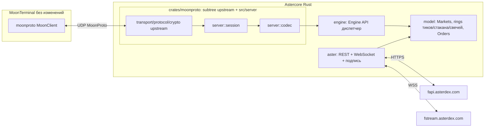

# Astercore: ядро Aster для MoonTerminal по MoonProto

Дата: 2026-10-01.

## Постановка

MoonTerminal — чужой проект, править нельзя; он подключается только к ядрам по MoonProto
(`moonproto::MoonClient`, UDP). Значит «подключить Aster» = **написать ядро-сервер**, для
терминала неотличимое от ядра Moonbot.

Рядом в `../TInvestCore` уже стоит такое ядро для T-Invest: 25 k строк своего кода поверх
вендоренного `moonproto` + серверная сторона протокола. **Astercore — его адаптация, не
переписывание с нуля.** TInvestCore не трогаем ни одной строкой: код только в этой папке.

Решения трейдера (01.10): **только перпы** (`fapi`/`fstream`), разработка и верификация **на
Mac**, деплой решаем к M3–M4, порядок работы — по вехам TInvestCore. Способ подписи — открытый
вопрос (§10), но он не блокирует: M0 и M1 целиком на публичных эндпоинтах.

## Главное: Aster — клон Binance USDⓈ-M Futures, а MoonProto сделан под Binance

Это определяет весь объём работы. TInvestCore потратил бóльшую часть сил на то, чтобы **согнуть**
российского брокера акций под крипто-форму MoonProto. На Aster гнуть не надо — форма совпадает, и
почти вся эта работа **исчезает**:

| в TInvestCore | на Aster | следствие |
|---|---|---|
| служебный рынок `RUBUSDT` ради `currency_usd_rate` | не нужен | `is_usd_stable("USDT") → 1.0` закорачивает расчёт до любого поиска рынка (`moon-core/src/symbol/mod.rs:39`, `market/source/read.rs:249`) — **проверено по исходнику терминала** |
| лоты, `floor(size/(price × lot))` | `stepSize`/`tickSize`/`MIN_NOTIONAL` | размер — обычное округление к шагу |
| `Quotation = units + nano/1e9`, carry | decimal-строки | `tinvest/json.rs` в этой части не нужен |
| `TradingSchedules` как гейт входов | статус символа | но **не исчезает совсем**: см. ниже про stock/forex |
| MOEX ISS для глубокой истории (`chart_history.rs`, `tinvest/moex.rs`) | `/fapi/v1/klines` своей биржи | минус два модуля и отдельный поток под них |
| grpc-web + protobuf, 9 server-side стримов | REST + WebSocket | `tinvest/proto.rs` не нужен |
| MSK, московная полночь, торговые часы | UTC круглосуточно | `tinvest/time.rs` сворачивается |
| Russian Trusted Root CA в системе | обычный TLS | `crates/*/certs/` не нужен |
| плечо / hedge / funding / ликвидации — вне объёма | **есть в API, и в Engine API есть слоты** (`SetLeverage`, `SetHedgeMode`, `QueryHedgeMode`, `ChangePositionType`, `ConfirmRiskLimit`) | появляется новая работа |
| `DontSellBelowLiq`, `StopAboveLiq`, `PanicSellDelisted` — хранятся, не применяются | **применимы** | поля MoonBot наконец делают то, что написано |
| `Delta_BTC_*` читался как `Delta_MOEX_*` (у MOEX нет BTC) | `BTCUSDT` есть | возвращаемся к **родному** смыслу MoonBot |
| `exchange_type_mask: SPOT` | **`FUTURES`** | терминал показывает в Assets только открытые позиции и читает `leverage_x` по рынкам (`moon-core/src/feed/types.rs:787`) |

## Ground truth: замерено 01.10 с Mac, не из головы

REST и WebSocket с Mac доступны **напрямую**, без прокси: `/fapi/v1/time` — HTTP 200 за 0.30 с,
`wss://fstream.asterdex.com` — рукопожатие 0.82 с, пять стримов пошли сразу.

**Каталог** (`/fapi/v1/exchangeInfo`, 843 KB): **613 символов**, из них `TRADING` 589,
`SETTLING` 19, `PENDING_TRADING` 5. `contractType`: 608 `PERPETUAL`. `timezone: UTC`.
Маржинальный актив: 596 `USDT`, 15 `USD1`, 2 `U`.

**Каталог не чисто крипто** — и это прямо кормит `MarketTags`:

| `underlyingSubType` | шт | `channel` | шт |
|---|---|---|---|
| — (обычная крипта) | 353 | `{}` / пусто | 480 |
| `STOCK` (+`Semiconductor`, `ETF`, `AOS2`, `USD1-RWA`, `pre-launch`) | 119 | `nasdaq` | 107 |
| `Meme` | 61 | `forex` | 11 |
| `AI` | 42 | `hkstock` | 7 |
| `Top` | 17 | `krstock` | 6 |
| `Commodities` | 9 | `astock` | 2 |
| `ETF` | 6 | | |

`tradingMode: 1` у 130 символов (`0` у 483) — почти ровно те же, что с биржевым `channel`. То есть
**у акций, форекса и сырья есть торговые сессии**, и гейт расписания из TInvestCore не умирает,
а переезжает на `status` + `tradingMode`/`channel`. Это замер, а не догадка: 130 ≈ 107+11+7+6+2
плюс пред-листинги.

**Фильтры** (BTCUSDT): `tickSize 0.1`, `stepSize 0.001`, `MIN_NOTIONAL 5` USDT,
**`MAX_NUM_ORDERS 200`** на символ, **`MAX_NUM_ALGO_ORDERS 10`** на символ,
`PERCENT_PRICE multiplierUp/Down 1.02/0.98`, `marketTakeBound 0.02`, `triggerProtect 0.02`,
`liquidationFee 0.025`, `maintMarginPercent 2.5`, `requiredMarginPercent 5.0`.
`orderTypes` одинаковы у всех 613: `LIMIT, MARKET, STOP, STOP_MARKET, TAKE_PROFIT,
TAKE_PROFIT_MARKET, TRAILING_STOP_MARKET`. `timeInForce`: `GTC, IOC, GTX, HIDDEN`.

Три последствия, каждое меняет код:

1. **`PERCENT_PRICE ±2 %` убивает приём TInvestCore «лимит глубоко сквозь книгу».** Там
   принудительное рыночное закрытие — это лимит, прижатый к ценовой границе коридора MOEX
   (±10…40 %). Здесь граница ±2 % от марки, сквозь неё лимит не поставить. Паника и стоп-лосс
   должны уметь `MARKET` / `closePosition=true` — §10, открытое решение.
2. **`MAX_NUM_ALGO_ORDERS 10`** — биржевых условных заявок на символ только десять. Стопы
   TInvestCore ядро ведёт **само** (следит за ценой и шлёт лимит), а не вешает на биржу, поэтому
   портируемая конструкция в этот потолок не упирается. Записано, чтобы никто не «улучшил».
3. **Три лимита нагрузки, а не два:** `REQUEST_WEIGHT 2400/мин`, `ORDERS 1200/мин` и
   **`ORDERS 300/10 с`** (третий в доках general-info не назван, виден только в `exchangeInfo`).
   `api_meter.rs` получает третье окно.

**Лимиты читаются из ответа, а не считаются нами:** `x-mbx-used-weight-1m: 42` приходит заголовком.
Это точнее, чем собственный счётчик TInvestCore.

**Прогрев одним вызовом.** `/fapi/v1/ticker/24hr` без `symbol` — **608 строк, weight 42**, и в
каждой `quoteVolume` = оборот в USDT за 24 ч. Весь прогрев `warmup.rs` с MOEX ISS (дневной оборот
каждого борда) сворачивается в один запрос.

**Свечи:** 12 ячеек, и **base, и quote оборот в одной свече** — cell 5 `volume` (базовый,
`4.085` BTC), cell 7 `quoteVolume` (`341552` USDT), cell 8 `count`, cell 9/10 — taker buy.
Конфликта «какой объём отдавать» нет: см. §«Объёмы» ниже. История BTCUSDT 1d с `startTime=0` —
**с 2021-09-01**, пять лет.

**Стакан: `@depth20@100ms` — полноценный снимок, не дельты.** Замер 6 с, два стрима рядом:

| стрим | сообщений | `(len(b), len(a))` | уровней с qty = 0 |
|---|---|---|---|
| `btcusdt@depth20@100ms` | 55 | **только (20, 20)** | **0** |
| `btcusdt@depth@100ms` | 56 | (1,1)…(1,4) | **478** |

То есть `@depth20` каждым сообщением отдаёт топ-20 целиком, stateless, самоисцеляется после
реконнекта. Берём его — и вместе с ним **исчезает весь класс кода**: локальный стакан,
`U`/`u`/`pu`-менеджмент, снимок по REST со сшивкой, инвалидация протухшей книги, `ReloadOrderBook`
как восстановление. (`pu == prev_u` сошёлся 54/54 и 55/55 — последовательность не рвётся, но для
`depth20` это и не нужно.)

**Ликвидность Aster тоньше Binance:** BTCUSDT — 658 M USDT и 47 809 сделок за 24 ч,
`aggTrade` 12 сообщений за 8 с. На архитектуру не влияет, на настройку стратегий — влияет;
к M3 это числа, по которым считаются `MinVolume`/`MaxVolume`.

## Архитектура



```
Astercore/
  Cargo.toml              workspace: crates/moonproto, crates/aster-core
  MOONPROTO_REV           2e67562f29294228db2996aa818d6cbef4d62e27 — тот же rev, что у TInvestCore
  crates/moonproto/       git subtree upstream + src/server/ (переносится как есть)
  crates/aster-core/src/
    aster/                НОВОЕ: rest.rs, ws.rs, sign.rs, catalog.rs, time.rs
    ...                   портированные модули
  tools/                  check-vendor.sh, sync-moonproto.sh, aster-core.service
  AGENTS.md README.md PLAN.md
```

### `crates/moonproto` — переносится, не пишется

Серверная сторона (`src/server/`, **5281 строка**: `session.rs`, `codec/{trade,strat,market_data,
engine,report,ui,balance,log}.rs`, `wire.rs`, `key_export.rs`) — это чистый MoonProto, в ней нет
ни одного байта T-Invest. Переносится **как есть**, вместе с `tools/check-vendor.sh` и
`sync-moonproto.sh` и тем же `MOONPROTO_REV`: инвариант «от upstream отличаются только
`src/server/**` и строка `pub mod server;` в `lib.rs`» сохраняется в обоих репозиториях.

Порядок, чтобы `check-vendor.sh` остался честным: `git init` → `git subtree add --prefix
crates/moonproto https://github.com/Moonbot-Tech/MoonProtoBeta <rev>` → **отдельным коммитом**
поверх — наш `src/server/` и хук в `lib.rs`.

### Что наследуется из `tinvest-core` и в каком состоянии

| переносится почти без правок | правится под venue | заменяется / удаляется |
|---|---|---|
| `moonshot.rs` `drops.rs` `strike.rs` `hook.rs` — движки детектов | `model.rs` — каталог и цены | `tinvest/` → `aster/` целиком |
| `stops.rs` `bvsv.rs` `windows.rs` `tape.rs` | `engine.rs` — `ServerInfo`, Engine API | `tinvest/moex.rs` + `chart_history.rs` (MOEX ISS) |
| `screener.rs` `guards.rs` `autostop.rs` | `orders.rs` — размер, коды ошибок | `tinvest/proto.rs` (protobuf) |
| `order_store.rs` `reports.rs` `emulator.rs` | `trading.rs` — позиции, баланс | `tinvest/json.rs` (Quotation) |
| `trades_stream.rs` `strategies.rs` `strategy_file.rs` | `feed.rs` — потоки → WebSocket | `warmup.rs` → один `ticker/24hr` |
| `settings.rs` `control.rs` `web.rs` `telegram.rs` `chart.rs` | `subs.rs` — чанки 200 вместо 300 | `schedule.rs` → статус символа + сессии |
| `key_store.rs` `stderr_log.rs` `load.rs` `stream_health.rs` | `api_meter.rs` — три окна, заголовки | `tinvest/time.rs` (MSK) |

Стратегийный движок — самая ценная и самая venue-независимая часть: решения там чистые
(`moonshot.rs` — «чистые решения → команды»), а брокер входит только тиками, стаканом и ордерами.

## Модель данных Aster → MoonProto

- **Рынок = символ**, имя как есть: `BTCUSDT`. Терминал разбирает Binance-форму нативно
  (`coin_of_market`: `ADAUSDT → ADA`). Квота: 596 `USDT`, 15 `USD1`, 2 `U` — **в M0 берём только
  596 USDT**, остальные вне каталога (одна база валюты у `base_currency`).
- `tick_size` = `PRICE_FILTER.tickSize`; шаг размера = `LOT_SIZE.stepSize` (для `MARKET` —
  `MARKET_LOT_SIZE`); `min_qty` = `LOT_SIZE.minQty`; нижний порог ордера = `MIN_NOTIONAL.notional`.
  `lot` в смысле MoonProto = 1: шаг размера несёт `stepSize`, а не лот.
- `base_currency_name/code` = `USDT`; `exchange_type_mask` = **`FUTURES`**;
  `exchange_code` = **221**, `exchange_name` = `"Aster"` (220 занят T-Invest). `venue(221) == None`
  → терминал рисует ядро в секции `reported` без логотипа, как и tinvest-core.
- `leverage_x` по рынку — из `/fapi/v1/leverageBracket` и `ACCOUNT_CONFIG_UPDATE`. С битом
  `FUTURES` терминал читает его для тулбара, так что поле не декоративное.
- **`MarketTags`.** В TInvestCore было `shares, futures, etf, bonds`. Здесь из замеренной
  таксономии: `crypto, stock, forex, commodities, etf, meme, ai, rwa, prelaunch` —
  `underlyingSubType` + `channel`. `!tag` исключает, как было.
- **Объёмы.** Два разных числа, и их нельзя путать:
  - в **deep-history** строки чарта уходит **базовый** объём (cell 5 свечи). Обязательно базовый:
    `volume_is_quote(code)` терминала для неизвестного кода отдаёт `false`
    (`moon-core/src/venue.rs`, таблица в докстринге), и quote там прочитался бы как базовый;
  - в **окна оборота** для `MinVolume`/`MaxVolume`/`MinuteVol`/`DailyVol` идёт **quote** (USDT) —
    cell 7 свечи, `quoteVolume` из `ticker/24hr`, `p × q` по `aggTrade`. Это родной смысл MoonBot
    (у него на этом месте BTC-оборот).
- `Delta_MOEX`/`Delta_Market`/`Delta_BTC_*` → **часовая дельта `BTCUSDT`**. Возврат к исходному
  смыслу MoonBot; `IMOEXF` как служебный рынок исчезает.
- **Время** — UTC везде; на границе пакетов Delphi `TDateTime`, конвертер уже в
  `moonproto::server`. Дрейф часов: `/fapi/v1/time` на старте и периодически, дельта хранится —
  иначе `-1021 INVALID_TIMESTAMP`.
- **Свечи:** 1m/5m из `/fapi/v1/klines`; `RequestCandlesData`, `RequestMarketHistory`,
  `GetCoinCardCandles` — тот же `klines` с агрегацией в запрошенный таймфрейм. Интервалы биржи:
  `1m 3m 5m 15m 30m 1h 2h 4h 6h 8h 12h 1d 3d 1w 1M`.

## Транспорт

**REST — `ureq` остаётся.** Он уже в дереве, синхронный, собран с `socks-proxy` (пригодится, если
боевое уедет туда, где Aster геоблокирован). Подпись — `hmac` + `sha2` (v1) либо `k256` +
`keccak` (v3), §10.

**WebSocket — новая зависимость.** Архитектура TInvestCore сознательно без Tokio (поток на стрим,
каналы), поэтому берём **`tungstenite`** (синхронный, `rustls`), а не `tokio-tungstenite`: он
ложится в существующую модель потоков `feed.rs` ровно, без рантайма.

- **Комбинированный стрим**, набор в URL при коннекте (`/stream?streams=a@aggTrade/b@depth20@100ms`)
  — тогда лимит «10 входящих сообщений/с» не трогаем вовсе; `SUBSCRIBE` пачкой — только для
  динамических добавлений.
- **200 стримов на коннект.** `aggTrade` на весь каталог = 613 стримов → **4 коннекта**; `depth20`
  по пулу стратегий → ещё 1–2. `subs.rs` (стабильная карта чанков, грейс на выбывающие ключи) —
  портируется, размер чанка 300 → 200, и чанк теперь = коннект.
- **Коннект живёт максимум 24 ч** → плановая ротация с фазовым разносом, чтобы коннекты не слепли
  разом (приём из `tinvest/stream.rs`, там ротация была раз в 10 минут). Период подберём замером.
- Сервер пингует раз в 5 мин, pong нужен в пределах 15 мин — `tungstenite` отвечает сам, пока мы
  читаем. Живость — по возрасту последнего кадра, как в `stream_health.rs`.
- **Пользовательский стрим** — отдельный коннект: `POST /fapi/v1/listenKey`, `PUT` раз в ~30 мин
  (ключ живёт 60), события `ORDER_TRADE_UPDATE`, `ACCOUNT_UPDATE`, `ACCOUNT_CONFIG_UPDATE`,
  `MARGIN_CALL`, `listenKeyExpired`. Это замена `OrderStateStream` + `PositionsStream` +
  `PortfolioStream` — три стрима одним.
- Сверка после реконнекта остаётся: `GET /fapi/v1/openOrders` по заявкам, `GET /fapi/v2/positionRisk`
  по позициям, `GET /fapi/v2/balance` по деньгам.

## Ордера и политика ошибок

- `POST /fapi/v1/order`, идемпотентность — `newClientOrderId` (36 символов), ретрай тем же id.
  Отмена `DELETE /fapi/v1/order`, пачкой `DELETE /fapi/v1/batchOrders` (до 5),
  `DELETE /fapi/v1/allOpenOrders` по символу.
- **Размер:** терминал присылает нотионал → `qty = floor_to_step(notional / price, stepSize)`,
  затем проверки `minQty` и `MIN_NOTIONAL` (5 USDT), отказ с названной причиной при нуле.
- **Режим позиции в M2 — one-way (`positionSide: BOTH`).** Ордерная модель TInvestCore (нога
  входа + нога выхода, `is_short` зеркалит обе) ложится на него без правок. Hedge mode — M5+.
- **`reduceOnly: true` на выходах** — выход физически не может перевернуть позицию. В TInvestCore
  такой защиты не было вовсе.
- **Коды ошибок** (замена таблице `30042/30059/80006/70001` T-Invest):

| код | смысл | политика | аналог в TInvestCore |
|---|---|---|---|
| `-1003`, `-1015`, HTTP 429/418 | лимит запросов/заявок | rate-halt по `x-mbx-used-weight-1m` и `x-mbx-order-count-*` | `70001`, `429` |
| `-1021` | timestamp вне `recvWindow` | пересинк `/fapi/v1/time`, повтор | — (новое) |
| `-2019`, `-2018`, `-4051` | маржи / баланса не хватает | бюджет входов на рынке в ноль, не паника | `30042` |
| `-2013` | заявки не существует | перечитать `GET /fapi/v1/order` | `30059` |
| `-2021` | «сработала бы сразу» | сдвинуть стоп-цену с учётом `triggerProtect` | `30099` (вне коридора) |
| `-2022`, `-4061` | `reduceOnly` отклонён / не тот `positionSide` | **громко**: это баг конфигурации, не рынок | — |
| `-2024` | позиции не хватает | перечитать `positionRisk` | — |
| `-4140`, `-4141` | символ закрыт / нельзя открывать | рынок вон из вселенной, `PanicSellDelisted` | `30079` |
| `-4161` | нельзя снизить плечо в isolated | отказ, в журнал | — |

- **Правило остановки переносится дословно** (TInvestCore, 28.09): остановка снимает всё, что
  способно открыть или увеличить позицию; выходы остаются, потому что позиция без своего стопа
  хуже, чем позиция. Флаг `stopping` закрывает обе двери входа (проход стратегий и команду `Start`
  от терминала), съём идёт каждым проходом, бюджет считается **из замеренной скорости шлюза
  Aster**, а не копируется: у T-Invest это 45 с при 4.5–5.5 подтверждений/с, здесь лимит
  `ORDERS 300/10 с`, то есть арифметика другая. `TimeoutStopSec` в юните — та же арифметика во
  втором файле.
- `POST /fapi/v1/countdownCancelAll` — биржевой dead-man switch; **как общий предохранитель не
  годится**: он снимает все заявки, включая выходы, то есть ровно то, что правило остановки
  запрещает. Рассмотреть как настраиваемое последнее средство, не как умолчание (§10).

## Что появляется впервые (чего у MOEX не было)

- **Funding:** `/fapi/v1/premiumIndex` + `@markPrice@1s` (`r` — ставка, `T` — время следующего
  фандинга). Стоимость удержания позиции и гейт «не входить перед фандингом». Новый модуль.
- **Цена ликвидации:** `positionRisk.liquidationPrice` + замеренные `maintMarginPercent`,
  `requiredMarginPercent`, `liquidationFee` → `DontSellBelowLiq` и `StopAboveLiq` начинают
  работать.
- **`MARGIN_CALL`** в пользовательском стриме → тревога в чат.
- **Поток ликвидаций** `!forceOrder@arr` — сигнал, которого на MOEX нет в принципе, и у MoonBot
  под него есть стратегии. Вне объёма M0–M4, записано как задел.
- **Mark price против последней цены:** `workingType` у биржевых стопов. Стопы ядро ведёт само по
  своей ленте, поэтому умолчание — `CONTRACT_PRICE`; `StopLossEMA` уже считает по своим тикам.
- **Делистинги:** `status` `SETTLING`/`CLOSE` + `deliveryDate` → `PanicSellDelisted` применим.
- **Торговые сессии у акций/форекса** (130 символов с `tradingMode: 1`) — новая форма старого
  гейта расписания.

## Decommission (§4): что должно исчезнуть, а не остаться рядом

Это список, по которому в конце каждой вехи идёт grep. Орфанный код из TInvestCore не «лежит на
всякий случай» — его нет: `tinvest/moex.rs`, `tinvest/proto.rs`, `chart_history.rs`,
`warmup.rs`-через-ISS, `schedule.rs`-через-`TradingSchedules`, `tinvest/time.rs`-MSK, служебные
рынки `RUBUSDT` и `IMOEXF`, лотовая арифметика, `Quotation`, `certs/`. Ни одного compat-алиаса,
ни одной ветки «если это T-Invest».

## Вехи

Каждая веха кончается **наблюдаемым** результатом — не зелёной сборкой.

### M0 — ядро доходит до Ready
Скелет воркспейса; `moonproto` subtree + наш `src/server/` отдельным коммитом; `check-vendor.sh`
зелёный. Ключ сервера (`key_store.rs`, формат `import_key`). `aster/rest.rs` с публичными
вызовами и чтением заголовков лимитов. Каталог из `exchangeInfo`: 596 USDT-перпов, фильтры, теги,
плечо. Init-хребет: `BaseCheck` (код 221, `"Aster"`, `FUTURES`, `USDT`), `AuthCheck`,
`GetMarketsList`, `UpdateMarketsList`, `GetMarketsIndexes`, схема стратегий, `QueryHedgeMode`,
`CheckAPIExpirationTime`, `CheckBinanceTags`, `ClientSettings`/`SharedConfig` эхо.
`AGENTS.md` с блоками `## Commands`, `## Secrets`, `## Release surface` и каналом наблюдения.
**Наблюдение:** терминал доходит до `LifecycleEvent::Ready`, контрактный тест на loopback поднимает
наш сервер и подключает `MoonClient` того же rev; строка `catalog:` в журнале с замеренными числами.

### M1 — маркет-дата
`aster/ws.rs` на `tungstenite`: комбинированные стримы, 4 коннекта под `aggTrade` каталога,
`depth20@100ms` по пулу, `kline_1m`, `markPrice@1s`. Лента в `TradesStream` с нумерацией пакетов,
`TradesResend`, heartbeat-пакеты (портируется). Стакан — снимок топ-20 без локальной книги.
Свечи и глубокая история из `klines`. Прогрев одним `ticker/24hr`. `stream_health.rs`, ротация
коннектов, `subs.rs` с чанком 200.
**Наблюдение:** терминал рисует стакан и чарт живого рынка — скриншот кадра, не вывод из кода;
строка `streams:` и `load:` в журнале.

### M2 — ручная торговля
`aster/sign.rs` (к этой вехе решение §10 нужно). Пользовательский стрим на `listenKey`.
Баланс и позиции (`/fapi/v2/balance`, `/fapi/v2/positionRisk`). Ордерная модель (`orders.rs`,
`order_store.rs`): нога входа + нога выхода, снимок `data/orders.json` через temp+rename **до**
отправки на биржу. Команды `Order` терминала: лимит, рынок, отложенный вход, переносы, отмены,
редактор стопов, паника, `ClosePosition`, `Move all`, `Immune for clicks`. Таблица кодов ошибок.
Правило остановки с бюджетом, замеренным на Aster.
**Наблюдение:** реальная заявка минимального размера (`MIN_NOTIONAL` = 5 USDT) выставлена,
исполнена, закрыта; плюс **одна несчастливая ветка** — отказ биржи и его обработка.

### M3 — стратегии
Порт `moonshot.rs`, `drops.rs`, `strike.rs`, `hook.rs`, `stops.rs`, `bvsv.rs`, `windows.rs`,
`screener.rs`, `guards.rs`, `autostop.rs`, `strategies.rs`, `strategy_file.rs`, `reports.rs` с
репликацией, `emulator.rs`. Вселенная по `MarketTags` новой таксономии, гейты входа, `Delta_BTC_*`
по `BTCUSDT`, окна оборота в USDT.
**Наблюдение:** сначала **эмулятор** — стратегия входит и выходит при нулевом денежном риске (это
и есть замена отсутствующему testnet); потом один живой заход минимальным размером.

### M4 — обвес оператора
`settings.rs` (`data/config.json`), `control.rs` (очередь команд), `web.rs` со страницей,
`telegram.rs`, `chart.rs` (PNG сделки), `api_meter.rs` с тремя окнами, коды выхода 0/70/1 и
systemd-юнит. Решение по боевому хосту.
**Наблюдение:** страница отвечает, в чат уходит закрытая сделка с картинкой.

### M5+ задел
Hedge mode и `positionSide`, управление плечом из стратегий, funding как гейт и как стоимость,
`!forceOrder@arr` как сигнал, спот вторым ядром со своим кодом и портом.

## Открытые решения

1. **Подпись (блокирует M2, не раньше).** v1 HMAC (`X-MBX-APIKEY` + secret, `hmac`+`sha2`,
   просто) против v3 EIP-712 (`k256`+`keccak`, typed data, ~300–500 строк со своим блоком тестов,
   зато **работает и на testnet**). Трейдер выясняет, какие ключи у него есть. До тех пор
   `aster/sign.rs` — одна функция «параметры → подписанный запрос» за `enum Credentials`, и выбор
   не разъезжается по дереву.
2. **Чем закрывать позицию.** TInvestCore никогда не закрывал рынком; на Aster `PERCENT_PRICE ±2 %`
   этот приём обнуляет. Предложение: входы и обычные выходы — маркетабельный лимит, как было;
   **паника и стоп-лосс получают `MARKET` / `closePosition=true`** — так делает MoonBot, и так
   позиция действительно закрывается. Решение трейдера.
3. **`countdownCancelAll`** как настраиваемый dead-man switch — или не брать вовсе (он снимает и
   выходы).
4. **Период ротации WS-коннектов** — замерить, не копировать 10 минут T-Invest.
5. **Квоты `USD1` и `U`** (15 и 2 символа) — вне каталога M0; возвращать ли их потом.
6. **Боевой хост** — решаем к M3–M4; с Mac и REST, и WSS доступны напрямую, прокси пока не нужен.

## Вне объёма (осознанно)

Прочие виды стратегий MoonBot, ATS, новости, репликация чужих БД, арбитраж, MM-ордера, Shield
Mode, 1001x, Prediction, спот в этом же ядре. `asterdex-sdk` с crates.io не берём: подпись и
WebSocket у нас свои, в синхронной модели без Tokio, а чужой async-клиент притащил бы рантайм.
