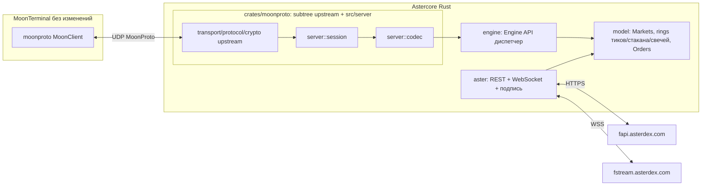

# Astercore: ядро Aster для MoonTerminal по MoonProto

Дата: 2026-10-01. **Ужат 03.10:** журналы сессий M0–M4 сняты (они в `git log`, по дням), остались
состояние, открытое, замеры и решения. История правок до ужатия — `git show 39d6ab9:PLAN.md`.

## Где мы сейчас (03.10) — начинать отсюда

**Код вех M0–M4 пройден до конца** (M0–M2 — 01.10, M3 — `bc0fc19`, M4 —
`4dd2cf0`), дальше шли ревью-долги, скорость и плечи. HEAD — `39d6ab9` (03.10 11:27). **Живое ядро
3101** — бинарь `aster-core-head4` в `scratchpad/live` (сборка 11:22 из дерева HEAD), ключ терминала
тот же, страница `http://127.0.0.1:3102`. Перед любым рестартом — `/api/status` → `orders`, и
спросить, если на бирже живые ордера (память `restart-live-core-myself`).

**Сделано 02–03.10 после M4** (подробности — в `trading.mdc`, `aster.mdc`, `git log`):
- путь заявок без очереди (`bb966a5`): 12 воркеров по рынку, выход вперёд входов других рынков,
  лимитер входов 200/10 с и 800/мин; замер: остановка стратегий — 58 отмен за 3,0 с (было 49–57 с);
- быстрый проход стратегий (`72af44f`): раз в 100 мс при живом ордере стратегии, не чаще 1/20 от
  длительности прошлого прохода; шаг EMA стопа по времени, 2150 мс; строка `shots:` раз в 5 мин
  (замер: 0,7–0,8 мс в среднем, 4–9 мс максимум на 597 рынках);
- снапшот ордеров терминалу раз в 10 с (`498e68e`) — попытка против призраков в таблице,
  **не доказанное лечение**;
- сырая лента `@trade` вместо `@aggTrade` (`0e101d6`), история часа из `v3/trades` +
  `historicalTrades` (`49b025b`);
- плечи: чтение по рынку и `SetLeverage` (`a28aabc`), «Настройка плеча» терминала и вкладка
  `Leverage` страницы (`7fa4335`…`64c8e78`), лесенка вниз по скобкам после `-5018` (`5e21b70`),
  остаток открытого интереса с сайта (`9e188ed`), `MinLeverage`/`MaxLeverage` как фильтр входа
  (`b882bbf`), разовый `set_isolated_max` (`c11e529`, с `--apply` не запускался);
- `PERCENT_PRICE` **односторонний** (`39d6ab9`, 03.10): покупка ниже марки и продажа выше неё не
  ограничены; до этого ядро отказывало во входах BTCUSDT/ETHUSDT/XAUUSDT как «outside the band»;
- `MarketTags` по умолчанию `all` (было `crypto`).

**Не замерено живьём** (каждое — одна проверка по журналу или кадру):
1. паника при запущенных стратегиях на 40+ рынках: `Panic Sell at MARKET` → `SELL MARKET … FILLED`
   должно быть ~1 с (было 31–46 с на одном воркере);
2. быстрый проход: `shots:` до ~10 проходов/с при живых ордерах, цена прохода ≤ 1 мс, объём журнала;
3. призраки в таблице терминала после отмен: если живут дольше 10–20 с — снапшот не лечит, разбирать
   клиентскую сторону (`moon-terminal`, `moonproto/state/orders.rs`, гипотеза про `apply_gone`);
4. MoveAll «Shift», ветка `-2022` (`4896aed`), сверка часов по `-4225` на живом отказе;
5. лента терминала против биржи после перехода на `@trade` (ожидание: 100 % печатей);
6. плечи: `Auto Leverage N`, терминальный `SetLeverage`, проход по всему счёту целиком.

**Чего ждём от трейдера** (кодом не закрыть): живой заход стратегии ~6 USDT с `EmulatorMode`
выкл. (классификатор не даёт мне ставить ордера; я смотрю журнал); testnet-ключ на
`asterdex-testnet.com`; токен Telegram-бота (вкладка Telegram страницы, PIN из журнала);
боевой хост (юнит готов, `/opt/aster-core`). **Решения трейдера, которые ждут:** вес EMA 1/N
(MoonBot) против 2/(N+1) и EMA «с запуска» против «с входа»; комиссия в `is_loss` (нужна ставка
счёта, `GET /fapi/v3/commissionRate`); свежесть рынка по сделке самого рынка, а не чанка стрима;
окна по поправке часов; `Idea.md` в публичном репо; шаг 2 `FastShotAlgo` (окно по трейдам
75–150 мс) — после замера п. 2.

**Правило трейдера:** на вопрос о поведении — сначала оригинал MoonBot
(`../TInvestCore/_target/MoonBotDemo`: `faqru.tsv`, exe, логи) и `_doc/STRATEGY_FORMULAS`; логи
ядра — только сверка.

## Наследство TInvestCore: ограничения, которых у Aster нет (исследование 03.10, разобрать)

Сверено по коду ядра, по тем же константам `tinvest-core` (все числа ниже скопированы один в один)
и по докам Aster V3 (`asterdex/api-docs`, `V3(Recommended)/EN/aster-finance-futures-api-v3.md`,
прочитаны 03.10). **Что уже вычищено и искать не надо:** расписания MOEX, `IMOEXF`, `RUBUSDT`,
лоты в рублях, канарейка `GetLastPrices`, `TradingStartDelay`/`EndCancel`, бюджет ошибок `80006`,
`MARKET_SPREAD`, запрет рыночных; комиссия идёт из стрима (`ORDER_TRADE_UPDATE.n`), не опросом.

Порядок — по цене наследства, каждое ждёт решения трейдера, кода не менял:

1. **Перенос = Cancel + Post, «выход никогда не переносится Replace»** (`trading.rs`
   `Action::Replace`). Родом от брокера, который ставил новую заявку на все N лотов, пока старая
   наливалась (лаг филов 7–11 с). У Aster есть **`PUT /fapi/v3/order`** (amend, вес 1, только
   LIMIT, цена и количество обязательны): id и `reduceOnly` сохраняются, при отказе фильтра старый
   ордер остаётся на месте. Сейчас перенос входа лесенки — два вызова (в `Limiter` считается как
   2), перенос выхода — отмена, окно без выхода, новый пост. MoonShot/Hook переставляют входы
   каждым проходом — это самое дорогое наследство.
2. **Стопы ведёт только ядро.** Мотивировка в `trading.mdc` — `MAX_NUM_ALGO_ORDERS = 10`, но
   лимит на символ, а не на счёт; T-Invest стоп-заявок не имел, поэтому выбора не было. На Aster
   `STOP_MARKET` + `closePosition=true` переживает падение ядра, обрыв связи и `RATE_HALT`; сейчас
   позиция без ядра — позиция без стопа. Если стопы уедут на биржу, снимается и возражение против
   `countdownCancelAll` («Открытые решения» п. 3).
3. **`POSITION_GRACE_MS = 10 с`** (`orders.rs`), и пропажа позиции подтверждается дважды с
   интервалом ≥ 10 с — число под лаг `GetPositions` T-Invest; `positionRisk` и user-стрим Aster
   отражают фил в миллисекундах. Сверка «продано вне ядра» срабатывает через 10–20 с.
4. **Сверка неопределённого запроса: 6 попыток 10→160 с (~5 мин)** (`REQUEST_GIVE_UP`). Под
   UUID-псевдонимы стрима и минутный бюджет `50005` T-Invest. На Aster
   `GET /fapi/v3/order?origClientOrderId` — вес 1, ответ окончательный; кода «дубль
   clientOrderId» в доках нет. Нога пять минут висит `uncertain` без причины.
5. **`REJECT_COOLDOWN_MS = 60 с`** на рынок после `-2019`/`-2018`/`-4051` и **`RATE_HALT_MS =
   60 с`** на всё после 429/418/`-1003`/`-1015` (`moonshot.rs`) — минутный бюджет T-Invest. На
   Aster маржа освобождается мгновенно отменой или филом; `-1015` — окно 10 с; 429 несёт
   `Retry-After` (уже читается в `rest.rs`); 418 — бан от 2 минут до 3 дней, 60 с его не покрывают.
6. **Вход стратегии за полосой не ставится, а не прижимается** (`Market::inside_limits`,
   «TInvestCore, by request, 21.09») — привычка планки MOEX; после 03.10 почти не срабатывает, но
   расходится с выходами и ручными ордерами, которые прижимаются (`within_limits`).
7. **`ClosePosition` / `Panic Sell ALL` закрывают только лоты ордеров ядра**, остаток счёта —
   «холд» (`orders.rs` «no position of the core to close»). Холд — облигации в приложении брокера
   как залог; на перпах любая позиция на счёте — позиция. Открытая с сайта или пока ядро лежало,
   из терминала не закрывается. Там же `core_long_units` считает только лонги.
8. **`RESTORE_PRICE_WAIT_MS = 5 мин` ожидания первой сделки после рестарта**, цена `ticker/24hr`
   «не живая» (`Market::live_price`). Логика «стоп торгов»; живость на Aster даёт
   `bookTicker`/`markPrice`, и на тонкой монете восстановленная лесенка снимается и ставится заново.
9. **Эмулятор: паника и стоп — лимит сквозь книгу, прижатый к полосе**, реал — `MARKET`.
   Проверка стратегии в эмуляторе показывает не то исполнение, что будет в реале.
10. **Окно оборота в «торговых часах»**, `HOUR_KEEP = 120 ч`, порог `HOUR_MIN_TURNOVER`
    (`windows.rs`) — под ночи и выходные MOEX. На крипте 24 торговых часа = 24 часа; на 121 акции с
    сессиями `DailyVol` читается как несколько сессий, а не сутки, как у MoonBot.
11. **Московское время константой** `TRADER_OFFSET_MS` (`clock.rs`): `WorkingTime`, окна
    автостарта, сутки журнала, сводка 23:50. MoonBot — локальное время машины, биржа — UTC.
    Верно для трейдера в Москве, но переезд ядра на хост в другой зоне правится в коде.

**Чем биржа богаче, а ядро не пользуется** (тот же корень — у T-Invest этого не было):
`GTX` post-only (мейкер 0 %, тейкер 0,04 %; лимит, пробивший рынок, платит тейкерскую);
`MarkPriceMin/Max` (Filters / Base MoonBot — вход далеко от марки, риск ликвидации; марка в ядре
есть, фильтра нет); `countdownCancelAll` (см. п. 2); `MIN_NOTIONAL` для reduce-only **не
действует** (`-4164` «unless you choose reduce only») — комментарий у `panic_retry_ms` про пыль
ниже 5 USDT как причину отказа выхода неверен; `priceProtect`/`workingType` у биржевых стопов;
`batchOrders` (5 постов или 10 отмен за вызов); `HFT` MoonBot (окно годности ордера — у v3 это
нонс ±60 с, `recvWindow` нет).

**Новое по докам, о чём память молчит:** акции США и HK торгуются 24/7, но вне сессии лимит
агрессивнее марки на 5 % отвергается, а **`MARKET` исполняется до 5 % от марки, остаток
отменяется** (`docs.asterdex.com`, stock-perpetuals, «Trading Sessions & Order Price Caps»;
марка в off-hours — EWMA). Паника ядра — `MARKET` без погони: на акции ночью она может закрыть
позицию частично, ответа на `EXPIRED`-остаток у паники нет, `has_sessions` в гейте не участвует.
Это не наследство, а дыра Aster-слоя — проверить живьём раньше остального. Форекс и
золото/серебро в доках описаны только под Shield Mode (закрыты пт 22:00 → вс 22:00 UTC, плечо
режется за час до закрытия); следуют ли им `XAUUSDT`/`EURUSDT` на книге — не сказано.

## Открытые долги по коду

Правило раздела: чекбокс снимается только после живой проверки или теста. Ниже — то, что после
ревью 02.10 (восемь ревьюеров на `9c253be`, 4 критичных + ~40 средних + ~50 мелких; критичные и
~55 прочих закрыты тестом или живьём, ~35 исправлены без снятия чекбокса) и семи пакетов правок
осталось с пустым боксом. Номера строк — по `9c253be`, искать по имени функции.

Исправлено, не подтверждено (нужен живой случай или тест на шов):
- `trading.rs` — сверка часов только по `-4225` и транспортным ошибкам (`clock_suspect_code`
  под тестом); вызов в потоке воркера — после живого `-2011`.
- `engine_ops.rs` — PNG сделки рисует поток `aster-deal-png`; живой сделки с картинкой не было.
- `aster/ws.rs` — `Beat::opened` бит не трогает, первый ping сразу; таймлайн стейла проверить на
  живом ядре. Перебор всех адресов `to_socket_addrs` (TCP); TLS-дыра на первом адресе остаётся.
- `feed.rs` — дедлайн коалесценции `COALESCE_MAX` 2 с; теста нет.
- `tools/aster-core.service` — `User=aster`, песочница; на Linux не запускалось.
- `telegram.rs` — невалидный прокси fail-closed; PIN из `/dev/urandom`; отвергнутый токен —
  `REFUSED_WAIT` 60 с (Transport и 409 пишутся каждый раз); `api_base` читается раз, подмена в
  журнале. Тестов на `apply` нет.
- `moonproto/src/server/mod.rs` — адрес сессии движется только за свежим Crypted-пакетом; Hello
  старше ±10 мин отбрасывается. **Остаётся:** повтор ImFriend/HelloAgain/Hello внутри окна
  переносит адрес (DoS, не раскрытие; нужен UDP-прокси для теста).
- `moonproto/src/server/session.rs:313` — потеря сообщения >256 срезов теперь `error`;
  вызывающий не узнаёт.
- `reports.rs` — строка одной записью `write_all`; в режиме `unreadable` rec_id с 1, эпоха
  выдумана. `order_store.rs` — fsync только на форсированном сохранении.
- `engine.rs` — рынок после `-4140/-4141` закрыт на час (`CLOSED_MARKET_MS`, `Gate::NotTrading`);
  теста на ворота нет. Срок ЧС ограничен веком, `saturating_add`; `secs_ms` — потолок 10 лет.
- `main.rs` — поток `api-meter` под `catch_unwind`; `stderr_log.rs` — `write_all` без паники на
  EPIPE, файл без буфера под мьютексом. Выбор кода выхода — только руками (AGENTS.md №8).
- `web.rs` — шапка 5 с и 503 на девятом соединении под тестом; застрявшее тело (`REQUEST_DEADLINE`
  20 с), шапка по байту и таймаут записи 503 — нет.

Не сделано, по решению или за неимением данных:
- `model.rs:595` — свежесть рынка по чанку стрима, а не по сделке рынка: неликвид «свеж», `PriceDown`
  по старому `last` (стопы уже по живой книге). Решение трейдера.
- `moonshot.rs:3923` — `is_loss` без комиссии (нужна ставка счёта). `windows.rs:83` — окна по
  времени биржи, чтение локальными часами без поправки.
- `reports.rs:187` — вид удалённой стратегии в новой строке всегда MoonShot (хранить вид в
  `CoreOrder`). `code: i64` внутри `TradingEvent::Failed` не несётся (тест строит текст из
  настоящего `rest::Error::Api`; нет теста на `-4140`, не-входную ногу и посторонний код).
- `tests/fixtures/*.json` — снимки TInvestCore (MOEX-id, `30042`); loopback-каталог только
  USDT/PERPETUAL (не-USDT и пустой `contractType` покрыты юнитом `model.rs`).
- `Idea.md` в публичном репо — решение трейдера. Дубли в `Cargo.lock` (rand/base64/digest/
  getrandom/syn) — ждать бампа upstream.
- Найдено при починке и оставлено: два встречных ручных отложенных на одном рынке в одном проходе
  уходят оба; битый блок стратегии пропадает при следующем сохранении (копия `.prev`);
  `manage_exit` и `stops.rs:545` берут `bid/ask` без возраста книги и `live_price`; `close_outside`
  бронирует по `last` без `live_price`; `AccountRead` возвращает в бюджет вход, взятый между
  чтением и ответом; `Replace` с Cancel прошёл / Post не ответил — 6 промахов по замыслу.

**Названные долги M2–M3** (не забыты): перенос входа с новым размером не проверяет фильтры биржи;
после сорванного `Replace` образ обновляется следующим `Query`; `liq_price` в `TBalanceFull` не
пишется; `DontSellBelowLiq`/`StopAboveLiq`/`PanicSellDelisted` в схеме, не читаются (на Aster
применимы — цена ликвидации, `deliveryDate`); `SSF_APPLY_TO_ORDERS` снимка не читается; ключи
сортировки `Funding`/`MarkPrice` не перенесены; `CheckFreeBalance` берёт с бюджета весь нотионал, а
не маржу; `TradingStartDelay` после смены статуса не воспроизводится (статус читается раз на
старте); `TRepTraceRequest` (Order 51) без ответа, пока нет трасс; свечи 5m — дыра ленты при
переподключении в запечатанных периодах не дозаливается, снапшот свечей (321 мс) собирается в
цикле UDP; плечи — Telegram-отчёт `tlg_report`, листинг между проходами ловится часовым,
`bracket_leverage` каталога не перечитывается, `Auto Leverage N` и терминальный `SetLeverage` не
смотрят на остаток OI; подписки ушедшего клиента освобождаются через 60 с (свойство вендорного
клиента, не чиним).

**Сверка `moonshot.rs` с `_doc/STRATEGY_FORMULAS/moonshot.md`** (02.10; дока — формулы ядра MoonBot
по крипто-ядрам, Aster среди источников нет). Совпадает: порог ухода `far + min(near, far − near)`,
`MShotAddDistance`, округление к шагу. Расходится, решения трейдера: вес EMA и её начало (выше);
новая цена при перестановке — у MoonBot минимум трейдов за ~75–150 мс, у нас экстремум с начала
ожидания (`wait_ref`); отсчёт `RaiseWait` — у MoonBot от минимума за окно и от последней
перестановки, у нас от первого нарушения коридора; не перенесены `MShotSellAtLastPrice`/
`MShotSellPriceAdjust` (формула в доке: `max(buy·(1+SellPrice), ask_4s·(1−Adjust))`),
`MShotMinusSatoshi`, модификаторы `MShotAdd1min/5min/24h/MarketDelta/PriceBug`, `MaxModifier`;
дефолты `MShotAdd15minDelta`/`MShotAddHourlyDelta` = 0.1 дока не подтверждает.

## Постановка

MoonTerminal — чужой проект, править нельзя; он подключается только к ядрам по MoonProto
(`moonproto::MoonClient`, UDP). «Подключить Aster» = написать ядро-сервер, для терминала
неотличимое от ядра Moonbot. Рядом в `../TInvestCore` стоит такое ядро для T-Invest (25 k строк
поверх вендоренного `moonproto`): **Astercore — его адаптация**, TInvestCore не трогаем.

Решения трейдера (01.10): только перпы (`fapi`/`fstream`), разработка и верификация на Mac,
деплой к M3–M4, порядок — по вехам TInvestCore, подпись v3 EIP-712.

## Главное: Aster — клон Binance USDⓈ-M Futures, а MoonProto сделан под Binance

TInvestCore потратил бóльшую часть сил на то, чтобы согнуть брокера акций под крипто-форму
MoonProto. На Aster форма совпадает, и почти вся эта работа исчезла:

| в TInvestCore | на Aster | следствие |
|---|---|---|
| служебный рынок `RUBUSDT` ради `currency_usd_rate` | не нужен | `is_usd_stable("USDT") → 1.0` до любого поиска рынка (`moon-core/src/symbol/mod.rs:39`) — проверено по исходнику терминала |
| лоты, `floor(size/(price × lot))` | `stepSize`/`tickSize`/`MIN_NOTIONAL` | округление к шагу |
| `Quotation = units + nano/1e9` | decimal-строки | — |
| `TradingSchedules` как гейт входов | статус символа | сессии акций — отдельно («Ground truth») |
| MOEX ISS для глубокой истории | `/fapi/v1/klines` | минус два модуля |
| grpc-web + protobuf, 9 стримов | REST + WebSocket | — |
| MSK, московская полночь, торговые часы | UTC круглосуточно | `tinvest/time.rs` свёрнут (но часы трейдера остались MSK — «Наследство» п. 11) |
| плечо / hedge / funding / ликвидации — вне объёма | есть в API и в Engine API (`SetLeverage`, `SetHedgeMode`, `QueryHedgeMode`, `ChangePositionType`, `ConfirmRiskLimit`) | новая работа |
| `DontSellBelowLiq`, `StopAboveLiq`, `PanicSellDelisted` хранятся, не применяются | применимы | долг M3 |
| `Delta_BTC_*` читался как `Delta_MOEX_*` | `BTCUSDT` есть | родной смысл MoonBot |
| `exchange_type_mask: SPOT` | **`FUTURES`** | терминал показывает в Assets только позиции и читает `leverage_x` |

## Ground truth: замерено с Mac, не из головы

REST и WebSocket с Mac напрямую, без прокси: `/fapi/v1/time` 0.30 с, `wss://fstream.asterdex.com`
рукопожатие 0.82 с.

**Каталог** (`/fapi/v1/exchangeInfo`, 843 KB, 01.10): **613 символов** — `TRADING` 589, `SETTLING`
19, `PENDING_TRADING` 5; `contractType` 608 `PERPETUAL`, 5 пустых (= `PENDING_TRADING`), дат-
фьючерсов нет; маржа 596 `USDT`, 15 `USD1`, 2 `U`. Независимая сверка: 596 + 0 + 17 = 613.
Не чисто крипто (`underlyingSubType` / `channel`): обычная крипта 353, `STOCK` 119 (`nasdaq` 107,
`hkstock` 7, `krstock` 6, `astock` 2), `Meme` 61, `AI` 42, `Top` 17, `Commodities` 9, `ETF` 6,
`forex` 11. **Сессии считаются по `channel`** (124 из 596; незнакомый канал — сессионный):
`tradingMode` — живой флаг, не свойство символа (10:29 UTC `1` у 121, 13:30 UTC — у 20: все 101
`nasdaq` перевернулись в `0` на открытии США; у `forex` `1` не стоял никогда). Что означает
`tradingMode` — открыто; по докам 03.10 поля нет вовсе, а стоки торгуются 24/7 с ценовыми капами
вне сессии («Наследство», последний абзац).

**Фильтры** (BTCUSDT): `tickSize 0.1`, `stepSize 0.001`, `MIN_NOTIONAL 5`, `MAX_NUM_ORDERS 200`,
`MAX_NUM_ALGO_ORDERS 10`, `PERCENT_PRICE 1.02/0.98` (**односторонний**, 03.10; по каталогу:
1.10/0.90 у 405, 1.05/0.95 у 151, 1.02/0.98 у 21, 1.15/0.85 у 8, 1.03/0.97 у 7, 1.04/0.96 у 4),
`marketTakeBound 0.02`, `triggerProtect 0.02`, `liquidationFee 0.025`, `maintMarginPercent 2.5`,
`requiredMarginPercent 5.0`; `LOT_SIZE.maxQty 1000` против `MARKET_LOT_SIZE.maxQty 120`.
`orderTypes` у всех 613: `LIMIT, MARKET, STOP, STOP_MARKET, TAKE_PROFIT, TAKE_PROFIT_MARKET,
TRAILING_STOP_MARKET`; `timeInForce`: `GTC, IOC, GTX, HIDDEN` (FOK и GTD нет).
Лимиты: `REQUEST_WEIGHT 2400/мин`, `ORDERS 1200/мин`, **`ORDERS 300/10 с`** (только в
`exchangeInfo`); расход читается заголовками `x-mbx-used-weight-1m`, `x-mbx-order-count-*`.
`POST order` вес 0, amend и cancel вес 1.

**Прогрев** — один `/fapi/v1/ticker/24hr` (608 строк, вес 42, `quoteVolume` в USDT). **Свечи** —
12 ячеек: cell 5 базовый объём, cell 7 quote, cell 8 count, 9/10 taker buy; история BTCUSDT 1d с
2021-09-01. `klines`: вес 1 до 99 баров, 2 до 499, 10 за 1500, 2000 — HTTP 400.

**Стакан** (решение 01.10): `@depth@100ms` + снимок `limit=1000` (как `MoonBot.exe`: `depthUpdate`,
`&limit=1000`); `depth20` давал ±0.02 % цены при зуме терминала ±10 %. Замер `/fapi/v1/depth`
BTCUSDT: 20 → ±0.02 %, 500 → −0.6/+0.9 % (вес ~10), **1000 → −2.3/+3.4 % (вес ~20, максимум)**.
Сшивка: `U`/`u` — одна последовательность, `lastUpdateId` снимка внутрь `[U, u]`, `pu == прежний
u` (0 разрывов на 72 событиях). Живьём: ~1000 уровней на сторону, книга клиента против REST-снимка
98.8–99.4 % уровней совпадают.

**WebSocket** (M1): 200 стримов на коннект (201-й — код 3003), весь каталог в одном URL — HTTP 414
→ три коннекта под ленту; `!markPrice@arr` — 767 символов раз в 3 с (`@1s` втрое тяжелее при ставке,
меняющейся раз в часы); `!bookTicker` — 23 503 кадра за 5 с, не берём, bid/ask каталога — REST раз в
2 с; лента 200 рынков — 3–14 кадров за 8–12 с, порог тишины 120 с; коннект живёт 24 ч, сервер
пингует раз в 5 мин. Сырой `@trade` даёт на 12–60 % больше печатей, чем `@aggTrade` (02.10).
**Ликвидность тоньше Binance:** BTCUSDT 658 M USDT и 47 809 сделок за 24 ч.

**Счёт** (M2, 01.10): v3 EIP-712 — `Message(string msg)` над form-encoded параметрами +
`nonce`/`user`/`signer`, домен `AsterSignTransaction`/`"1"`/chain **1666 mainnet, 714 testnet**,
подпись `r‖s‖v` хвостом `&signature=0x…`; mainnet принял с первого раза, testnet тем же ключом —
`-1000 Signature check failed`. `/fapi/v3/balance` + `/fapi/v3/positionRisk` вес 5 + 5;
`ACCOUNT_UPDATE` свободной маржи не несёт — события только будят перечтение. `listenKey`: повторный
POST возвращает тот же активный ключ (продление раз в 30 мин), **мёртвый ключ стрим не выдаёт** —
`/ws/<выдуманный>` получает 101 и отвечает на ping. `-4225 Nonce Expired` — так v3 называет нонс вне
окна (±60 с), `-1021` в v3 нет, `recvWindow` нет. Первый живой цикл 01.10: лимит исполнен частями
→ выход `reduceOnly` → перенос → `MARKET` закрытие; отказ `-2019` → `BUY_FAIL` без повторов.

**Плечи** (02–03.10, замер на счёте): `leverageBracket` обещает больше, чем даёт биржа — AVAX на
75× (скобка держит 25 000 $) отвечает `-5018`, на 16× тоже 0, на 15× — 954 294 $; «Remaining
openable notional» из диалога сайта подписанное API не знает (NEAR на 50× и 20× там 0, на 10× —
3 709 571 $, а `positionRisk.maxNotionalValue` говорит 1 000 000) — берётся из публичного
`GET www.asterdex.com/bapi/futures/v1/public/future/common/symbol/leverageoi/remaining?symbol=X`.

## Архитектура

Структура дерева и границы — `aster.mdc`; команды, секреты, канал наблюдения — `AGENTS.md`.
Синхронный ввод-вывод без Tokio: `ureq` (REST), `tungstenite` (WS), поток на стрим и каналы.

**`crates/moonproto` переносится, не пишется:** серверная сторона `src/server/` — чистый MoonProto,
ни байта T-Invest. Инвариант «от upstream отличаются только `src/server/**` и две строки хука в
`lib.rs`» держит `tools/check-vendor.sh`. Синк 01.10: `2e67562f` → `9fd0490` (upstream HEAD),
leak-review CLEAN; новое на wire — Telegram-панель терминала (UI 36–48, отвечаем «встроенного
Telegram нет»), трассы отчётов (Order 51/52).

**Что наследуется из `tinvest-core`:** почти без правок — движки детектов (`moonshot`, `drops`,
`strike`, `hook`), `stops`, `bvsv`, `windows`, `tape`, `screener`, `guards`, `autostop`,
`order_store`, `reports`, `emulator`, `trades_stream`, `strategies`, `strategy_file`, `settings`,
`control`, `web`, `telegram`, `chart`, `key_store`, `stderr_log`, `load`, `stream_health`;
правилось под venue — `model`, `engine`, `orders`, `trading`, `feed`, `subs` (чанк 200),
`api_meter`; заменено — `tinvest/` → `aster/`, ISS-прогрев → `ticker/24hr`, `schedule.rs` → статус
символа, `tinvest/time.rs`. Стратегийный движок — самая venue-независимая часть: решения чистые
(«чистые решения → команды»), брокер входит тиками, стаканом и ордерами.

## Модель данных Aster → MoonProto

- **Рынок = символ** как есть (`BTCUSDT`); квота только `USDT` (596), `USD1`/`U` вне каталога
  (у `moonproto::BaseCurrency` нет варианта, терминал имени не разберёт).
- `tick_size` = `PRICE_FILTER.tickSize`; шаг размера = `LOT_SIZE.stepSize` (`MARKET` —
  `MARKET_LOT_SIZE`); `lot` в смысле MoonProto = 1. Сайзинг — `trading.mdc`, «Сайзинг».
- `base_currency` = `USDT`; `exchange_type_mask` = **`FUTURES`**; `exchange_code` = **221**,
  `exchange_name` = `"Aster"` (220 — T-Invest); `venue(221) == None` → секция `reported` без логотипа.
- **Плечо:** `leverage_x` рынка — из `leverage` строк `positionRisk`; максимум — первый брекет
  `/fapi/v3/leverageBracket` (раз на старте, `Market.bracket_leverage`); `SetLeverage` терминала —
  `POST /fapi/v3/leverage` на потоке `aster-leverage`. `ACCOUNT_CONFIG_UPDATE` не потребляется:
  смена плеча видна после очередного чтения (событие будит перечтение), подтверждённая смена
  удерживается 20 с. `exchangeInfo` даёт только `requiredMarginPercent` (потолок инструмента).
- **Управление плечами** («Настройка плеча» терминала, `TLevManageCommand` cmd 9; вкладка
  `Leverage` страницы, `POST /api/leverage`; поток `aster-levman`, `data/lev_manage.bin`; проход
  по Apply, на старте и раз в час). Config — `(число) (монеты | def)`, число перед `def`, `0` — не
  управлять. Плечо рынка = наибольшее из скобок, у которого и `notionalCap`, и остаток OI с сайта ≥
  лимита; ничего не держит — плечо с наибольшим остатком; подъём, отказанный `-5018`, идёт лесенкой
  вниз по скобкам, все отказаны — «left alone». Рынок без цифр сайта плечо не поднимает. Приоритет
  как в MoonBot: лимит, затем `Auto Leverage N`; `Allow leverage Up` решает подъём, понижение
  всегда; `Auto Isolated`/`Auto Cross` — тип маржи. **Рынок с позицией или ордером не трогается**
  (решение трейдера 02.10); окно ~20 с внутри пачки из 60 рынков остаётся. Чтение остатка — 200 мс
  на рынок, кэш 10 мин, после 3 неудач подряд проход перестаёт спрашивать. Коды `-4046/-4047/-4048`
  (смена типа маржи при ордере/позиции) — по докам, на Aster не замерены.
- **`MarketTags`** — `crypto, stock, forex, commodities, etf, meme, ai, top, rwa, prelaunch`
  (`underlyingSubType` + `channel`), `all` — все классы (дефолт с 03.10), `!tag` исключает;
  незнакомый `channel` → `crypto` со строкой в `catalog:`.
- **Объёмы** — два числа: в deep-history чарта **базовый** (cell 5; `volume_is_quote` терминала для
  неизвестного кода — `false`), в окна оборота `MinVolume`/`DailyVol` — **quote** в USDT (cell 7,
  `quoteVolume`, `p × q` по ленте).
- `Delta_BTC_*`, `MShotAddBTC*` — часовая дельта `BTCUSDT`; `Delta_Market_*`,
  `MStrikeAddMarketDelta` — средняя часовая дельта живых рынков (раз в 10 с, от 20 рынков).
- **Время** — UTC на wire; на границе пакетов Delphi `TDateTime` (конвертер в `moonproto::server`).
- **Свечи** — `/fapi/v1/klines` 1m/5m с агрегацией; интервалы `1m 3m 5m 15m 30m 1h 2h 4h 6h 8h 12h
  1d 3d 1w 1M`. `RequestCandlesData` — 500 запечатанных 5m на рынок, прогрев `klines 5m limit 499`
  в 4 потока (596 рынков за 45 с), пауза при весе ≥ 1600.

## Транспорт

- REST — `ureq` (синхронный, `socks-proxy` на случай геоблока), подпись v3 на `k256` + `keccak`;
  трассировка ureq выключена навсегда (подписанный запрос), редиректы запрещены. `CALL_TIMEOUT` 30 с.
- WebSocket — `tungstenite` (тот же `rustls`/`ring`). Комбинированный стрим, набор в URL; три сессии
  `trade` на каталог, одна `!markPrice@arr`, динамические чанки `depth@100ms` и `kline_<i>` по
  подпискам терминала (`subs.rs`, чанк 200 = коннект). Ротация раз в 12 ч с разносом по фазе, свой
  ping раз в 30 с, разрыв после 75 с тишины (марки — 15 с). Живость — по возрасту кадра.
- Пользовательский стрим — `/ws/<listenKey>` на потоке `aster-user`; все подписанные вызовы —
  поток `aster-account` (один подписант — одна цепочка nonce; воркеры ордеров — клон с общим
  атомарным счётчиком). События будят REST-перечтение (через 250 мс, не чаще раза в 2 с); период
  15 с остаётся (нереализованный PnL ни одно событие не сообщает). Сверка после реконнекта:
  `openOrders` через 3 с после открытия стрима, `positionRisk`, `balance`.
- Путь заявок — `trading.rs` без очереди (`trading.mdc`, «Путь заявок на биржу»).

## Ордера и политика ошибок

Коды и политика — таблица в `trading.mdc` («Коды ошибок»); сайзинг и полоса — там же. Здесь — то,
что решает архитектуру:

- `POST/DELETE/GET /fapi/v3/order`, ключ — `newClientOrderId` (36 символов), `Replace` = Cancel +
  Post под новым ключом («Наследство» п. 1 — у биржи есть amend). Отмена пачкой `DELETE
  /fapi/v3/batchOrders` (до 10), `allOpenOrders` по символу — не используются.
- Режим позиции — **one-way** (`positionSide: BOTH`), ядро не стартует на hedge-аккаунте; `reduceOnly`
  в hedge-режиме биржа не принимает вовсе. Hedge — M5+.
- **`reduceOnly: true` на выходах** — выход не может перевернуть позицию (в TInvestCore защиты не
  было). Встречный вход ядра на том же символе снимается до reduce-only выхода, иначе `-2022`.
- Паника, стоп-лосс, трейлинг, «закрыть по рынку» — `MARKET` + `reduceOnly` без погони (решение
  01.10); лимитное закрытие и эмулятор — лимит сквозь книгу, прижатый к полосе.
- **Правило остановки** (TInvestCore, дословно): остановка снимает всё, что способно открыть или
  увеличить позицию; выходы остаются. `stopping` закрывает обе двери входа, бюджет слива 30 с
  (`STOP_WITHDRAW`; с 02.10 рынки параллельно по 12 воркерам, замер — 58 отмен за 3 с), затем
  `orders.json` и выход 0/1. Команда терминала отказывается при открытой позиции (как MoonBot).
  `TimeoutStopSec` в юните — та же арифметика.
- `countdownCancelAll` — биржевой dead-man switch, снимает и выходы: как умолчание не годится
  («Открытые решения» п. 3).

## Что появляется впервые (чего у MOEX не было)

- **Funding:** `premiumIndex` на старте + `!markPrice@arr`; стоимость удержания и гейт «не входить
  перед фандингом» — не сделаны.
- **Цена ликвидации:** `positionRisk.liquidationPrice` + `maintMarginPercent`,
  `requiredMarginPercent`, `liquidationFee` → `DontSellBelowLiq`/`StopAboveLiq` — долг M3.
- **`MARGIN_CALL`** в user-стриме → тревога в чат — не сделано. По докам это только предупреждение:
  ликвидация может уже пройти; ликвидация снимает все ордера и бьёт одним IOC, остаток — по
  банкротной цене в страховой фонд; ADL — статус `NEW_ADL`, `GET /fapi/v3/adlQuantile` раз в 30 с.
- **Поток ликвидаций** `!forceOrder@arr` — задел M5+.
- **Mark price против последней:** стопы ядро ведёт само по своей ленте, умолчание `CONTRACT_PRICE`.
- **Делистинги:** `status` `SETTLING`/`CLOSE` + `deliveryDate` (19 символов) → `PanicSellDelisted` —
  долг M3.
- **Сессии акций/форекса** — «Ground truth» и «Наследство», последний абзац.

## Находка M0: энкодер `MarketSpec` был зашит под MOEX нулями (закрыта 01.10)

`moonproto::server::codec::engine::MarketSpec` писал нулём всё Binance-специфичное, типы при
переносе не менялись — компилятор молчал, терминал получал «спот без фандинга и границ». Заполнены:
`futures_type` (`USDT`), `is_btc_market`, `leading1000`/`k1000`/алиас (12 символов `1000*`;
терминал читает только `market_currency_canonic`, свёрнутая монета), `bn_multiplier_up/down`
(`PERCENT_PRICE` каждого символа), `bn_min/max_price`, `bn_delivery_time` (`Option`, сентинел
2101 года в провод не уходит), `funding_rate/time` (снимок старта + `send_funding=1` в рядах).
Оставлены нулём осознанно: `bid_*`/`ask_*` (`ltMultiplierUp/Down` — не планка сторон: равна
основной у 504, расходится у 68, `0` у 24 включая BTCUSDT), `bn_max_notional` (фильтра нет),
`bn_only_isolated` (в `exchangeInfo` не выражено).

## Decommission (§4): что должно исчезнуть, а не остаться рядом

Grep в конце каждой вехи. Орфанный код TInvestCore не «лежит на всякий случай»: `tinvest/moex.rs`,
`tinvest/proto.rs`, `chart_history.rs`, `warmup.rs`-через-ISS, `schedule.rs`, `tinvest/time.rs`,
служебные рынки `RUBUSDT` и `IMOEXF`, лотовая арифметика, `Quotation`, `certs/`. Ни одного
compat-алиаса, ни одной ветки «если это T-Invest». Проверено 03.10: в коде нет; остатки —
`api_meter` (`Call::Held`, `TariffGroup` — ничего не триггерит), мёртвый `Orders::retry_exits`
(зовут только тесты), фикстуры тестов с MOEX-id.

## Вехи

Каждая веха кончается **наблюдаемым** результатом, не зелёной сборкой.

| веха | что | код | наблюдение |
|---|---|---|---|
| M0 — Ready | скелет, subtree + `src/server/`, ключ сервера, каталог, Init-хребет, `AGENTS.md` | 01.10 | терминал доходит до `Ready`; loopback-тест; строка `catalog:` сходится с независимым разбором (613) |
| M1 — маркет-дата | `ws.rs`, `feed.rs`, лента/стакан/свечи/CoinCard/история, фандинг в рядах, `RequestCandlesData` | 01.10 | скриншот трейдера: чарт, фандинг, окна, глубокий стакан; `streams:`/`load:` в журнале |
| M2 — ручная торговля | `sign.rs`, счёт, user-стрим, `orders.rs`, команды терминала, стопы и тулбар, остановка, MoveAll | 01.10 | заявка выставлена, исполнена, закрыта; `-2019` обработан; остановка снимает вход за 0,36 с |
| M3 — стратегии | движок TInvestCore целиком, `MarketTags`, гейты, эмулятор по умолчанию | `bc0fc19` 02.10 | эмулятор живьём (BTCUSDT шорт и лонг); **testnet и живой заход — за трейдером** |
| M4 — обвес | `settings`, `control`, `web`, `telegram`, `chart`, `api_meter`, коды выхода 0/70/1, юнит | `4dd2cf0` 02.10 | страница и кадр, рестарт → 70, сделка с картинкой через заглушку Bot API; **живой бот — за токеном** |
| M5+ задел | hedge mode и `positionSide`, плечо из стратегий, funding как гейт и стоимость, `!forceOrder@arr`, спот вторым ядром | — | — |

Что изменилось при переносе M3 (решения, не случайности): поля BTC под родными именами MoonBot;
гейты расписаний удалены из схемы; сработавший стоп живого ордера — `MARKET`, если выход не обязан
быть лимитом; размер входа меряется наименьшим ордером биржи (`MIN_NOTIONAL` 5 USDT); `EmulatorMode`
по умолчанию вкл., ядро без ключа ведёт стратегии только в эмуляторе (`data/orders-emulator.json`);
окна засеваются 5m-барами прогрева; нет user-стрима — нет живых входов; `OrderSize` по умолчанию
10 USDT (было 1000 в рублях).

## Открытые решения

Закрыты 01.10 трейдером: **п. 1 подпись — v3 EIP-712** (HMAC-пары нет; testnet тем же ключом не
принимает — нужен свой агент); **п. 2 закрытие — паника и стоп `MARKET`/`reduceOnly`**, входы и
обычные выходы — маркетабельный лимит; **п. 7 moonproto — всегда последняя версия**
(`tools/sync-moonproto.sh` берёт upstream HEAD; TInvestCore остался на `2e67562f`, перенос кодека
диффом проверяется сборкой).

Открыты:
3. **`countdownCancelAll`** как настраиваемое последнее средство — или не брать (снимает выходы).
   Пересмотреть вместе с «Наследство» п. 2 (стопы на бирже).
4. **Период ротации WS-коннектов** — 12 ч с разносом по фазе стоит без замера (T-Invest — 10 мин).
5. **Квоты `USD1` и `U`** (15 и 2 символа) — вне каталога; возвращать ли (нужен вариант
   `BaseCurrency` и имя квоты у терминала — пока их нет).
6. **Боевой хост** — к M3–M4; с Mac REST и WSS напрямую, прокси не нужен.
8. **Наследство TInvestCore** — раздел выше, 11 пунктов, каждый — решение трейдера.

## Вне объёма (осознанно)

Прочие виды стратегий MoonBot, ATS, новости, репликация чужих БД, арбитраж, MM-ордера, Shield
Mode, 1001x, Prediction, спот в этом же ядре. `asterdex-sdk` с crates.io не берём: подпись и
WebSocket свои, в синхронной модели без Tokio.
